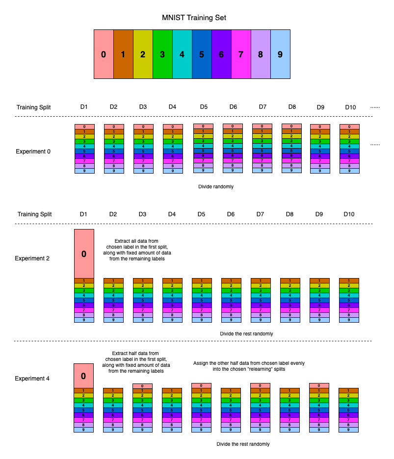

# Cobweb/4V

***Cobweb/4V***, a human-like visual concept learning system based on [COBWEB](https://link.springer.com/content/pdf/10.1007/BF00114265.pdf) and matrix representation.

## Experiments Overview:

In our experiments, we use MNIST dataset to evaluate several approaches: `cobweb4v`, `fc-{fast, slow}` (neural networks with fully connected layers only in two versions), and `fc-cnn-{fast, slow}` (fully-connected layers with additional CNN layers in two versions).

- **Experiment 0**: Learning and asymptotic performance
- **Experiment 1**: Forgetting
- **Experiment 2**: Forgetting and relearning

A visualization of the experiments when the chosen digit is `0` in Experiments 1 and 2 is shown below:

## Install Package

The very first thing is to install `concept_formation` as a python package:

	pip3 install -e [Your Directory]/concept_formation

Everything associated with the experiments are under `[Your Directory]/concept_formation/vision-experiments`.

## Experiments in the Original Paper

Suppose you are currently in the directory `[Your Directory]/concept_formation/vision-experiments`.

To gain the experiment results introduced in our paper, run the summarized shell scripts for the corresponding experiments (`exp0.sh`, `exp1.sh`, `exp2.sh`) in the current directory.

Suppose you want to have all results in Experiment 0 in the paper. First make the script executable using the `chmod` command:

	chomd +x exp0.sh

Then run the shell script in the current directory:

	./exp0.sh

After running all experiments, all results will be stored under the directory `./test_acc/exp0`, and each `csv` file is for the results of **one single** experiment. If you want to integrate them and make a statistical summary of this set of experiment using R, do the following:

- First concatenate all tables under the folder (`./test_acc/exp0` in this example) with the python script:
	
	`python3 concatenate_tables.py` (**MUST** run under the directory `./test_acc/exp0`)

	And all tables will be concatenated to a new `csv` file `exp0.csv`.

- Use R script `./plots/exp0.R` to output the figure.
	
	At the top of the R script, remember to indicate where `exp.csv` lies at.

	For instance, if the current working directory of R is THIS folder, just import the data with the following:

	`exp0 <- read_csv(./test_acc/exp0/exp0.csv)`

	You might need to indicate the directory where `exp0.csv` lies in directly since the current working directory of R by default is definitely not the current one until you configure this.

	After import the necessary packages and the data at the top of the script, just run the script till the end. 

	`print(p_chosen_1)` will invoke the figure output, and 

	`df_display_1 <- ggplot_build(p_chosen_1)$data[[2]]` will store the stats summary coresponding to the plot `p_chosen_1`.

The procedures are similar to Experiment 1 (`exp1`) and 2 (`exp2`).

## Run Separate Experiments as You Want!

You can just run AN experiment with any specified options you want. For instance, to run an Experiment 2 with the following:

- Evaluated approach: Cobweb/4V

- Random seed: 789

- Training splits in total: 12

- Retraining splits: Split 3, 7, and 11

- Chosen evaluted digit: 8

- Test with the test set comprised with the chosen digit (8) only.

You can run the following:

	python3 main.py --experiment=2 --model-type=cobweb --seed=123 --test=chosen --n-split=12 --label=8 --relearning-split 3 7 11

Another example. If you want to run an Experiment 1 with the following:

- Evaluated approach: `fc-cnn` (`fast` version)

- Random seed: 789

- Training splits in total: 6

- Number of samples extracted from non-chosen labels to the first split: 200

- Chosen evaluted digit: 8

- Test with the test set comprised with the chosen digit (8) only.

You can run the following:

	python3 main.py --experiment=1 --model-type=fc-cnn --seed=789 --test=chosen --n-split=6 --nn-ver=fast --label=8

For neural networks, you can even adjust the hyperparams with options like `lr` and `batch-size-tr`. To see all available details of the options, run

	python3 main.py -h

for help.

